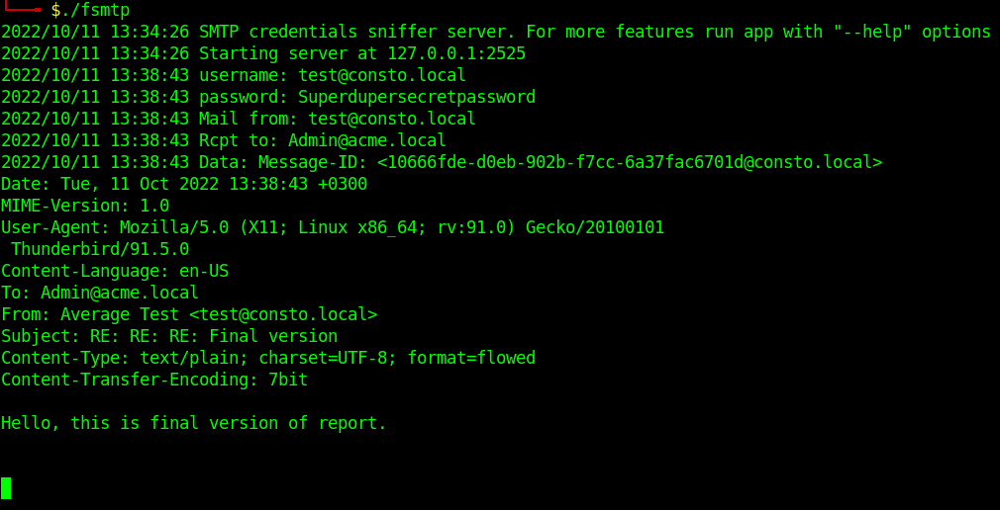

# fake-smtp
Fake SMTP server for email clinet debugging and credentials gathering.

## Overview
Simple Golang app for debugging email clients. May used as part of MitM attack during legal penteration tests. It's not a lternative huge frameworks like "Responder". The main goal of this app - is running on simple MIPS arch embedded devices, like routers.

**Dependencies**: this app use *go-smtp* package.

## Usage
Just run one of the released binaries for your platform, or build yours from sources.

If client connect to your server, server accept only insecure basic auth with plain text creds, which will be logged. In addtion all message body will be logged to.

**Note**: Server logging directly in stdout. If you need write to file, please use output redirect.

**Optional command-line arguments:**

*-Domain* Email domain (default "ACME.local")

*-address* The address on which it is being listened to. (default "127.0.0.1")

*-port* The port on which it is being listened to. (default 2525)
      

